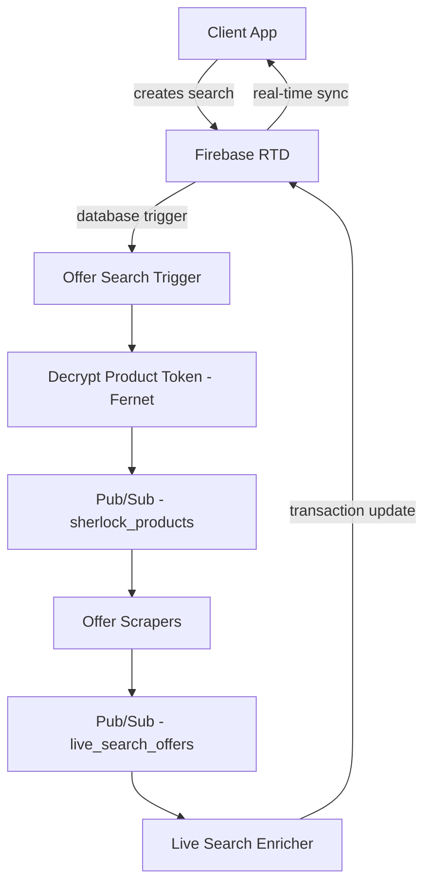

# sherlock_firebase

Real-time bidirectional sync between PostgreSQL and Firebase Realtime Database. Handles live price search requests from the client, triggers offer fetching, enriches results, and pushes updates back to Firebase for sub-second client rendering.

Part of the [Panprices](https://panprices.com) price intelligence platform.

## Architecture

## What it does

When a user searches for a product on Panprices, the system needs to fetch live prices from multiple sources and stream results back as they arrive. This repo handles that real-time loop:

1. **Offer search trigger** -- Firebase database trigger fires when a client creates a new search. Decrypts the product token (Fernet encryption), resolves the GTIN, and publishes to Pub/Sub to kick off scraping
2. **Live search enricher** -- Consumes scraped offers as they arrive from each source, enriches them with metadata (savings calculations, retailer info), and writes back to Firebase using transactions to handle concurrent updates
3. **Popular product refresh** -- Periodically re-fetches prices for popular products to keep cached data fresh
4. **Data cleanup** -- Scheduled function that flushes stale search data from Firebase

## Key technical decisions

- **Firebase Realtime Database** for sub-second client updates -- clients subscribe to a path and receive updates as each scraper returns results
- **Fernet encryption** for product tokens -- GTINs are encrypted in client-facing URLs to prevent scraping of the product catalog
- **Transaction-based updates** -- Firebase transactions prevent race conditions when multiple scrapers write results for the same search concurrently
- **Pub/Sub decoupling** -- the trigger function only publishes a message; actual scraping happens in separate services

## Stack

Python, Firebase Admin SDK, Cloud Functions, Cloud Pub/Sub, Fernet encryption, PostgreSQL
